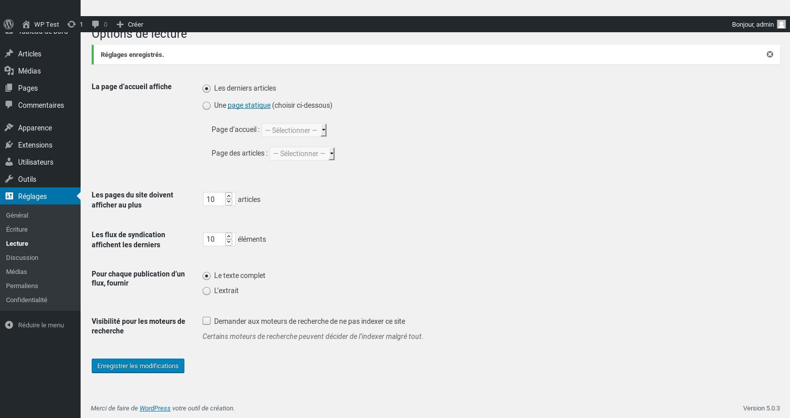

# Wordpress - Développement de thème

## Page d'accueil personnalisée

Par défaut, la page d'accueil de Wordpress utilise la liste des articles.
Autrement dit, quand on appel l'URL `http://example.com/`, Wordpress utilise le fichier `index.php` pour afficher le contenu de la page.

Mais il est possible de modifier ce réglage par défaut :

### Exemple avec une page d'accueil et une page de news

L'idée est d'avoir un fichier PHP qui affiche la page d'accueil et un autre fichier PHP qui affiche la page des News.
Cela nous permettra de personnaliser l'affichage.

Pour faire cela, il faut tout d'abord :

- créer une page nommée Accueil
- créer une autre page nommée News
- créer un fichier nommé `front-page.php`
- créer un fichier nommé `home.php`
- configurer la page d'accueil et la page des articles de Wordpress

La page News affichera une liste de news.
En réalité, ces news sont de simples articles.
La page News aurait pu s'appeler Foo, cela n'aurait rien changé, elle aurait tout de même affiché la liste des articles.

Voici un contenu possible du fichier `front-page.php` :

    <?php
    // wp-content/themes/my-theme/front-page.php

    get_header();

    if ( have_posts() ):
        while (have_posts()):
            the_post();
    ?>
        <article>
            <h1><?php the_title(); ?></h1>
            
<?php the_content(); ?>

        </article>
    <?php
        endwhile;
    endif;

    get_footer();

Voici un contenu possible du fichier `home.php` :

    <?php
    get_header();

    if ( have_posts() ):
        while (have_posts()):
            the_post();
    ?>
        <article>
            <h1><a href="<?= get_permalink(); ?>"><?php the_title(); ?></a></h1>
            
<?php the_content(); ?>

        </article>
    <?php
        endwhile;
    endif;

    get_footer();

Maintenant, il faut changer les réglages de Wordpress :

- aller dans la page **Admin > Réglages > Lecture**
- choisir l'option **Une page statique**
- sélectionner la page Accueil comme page d'accueil et la page News comme page d'articles
- enregistrer les modifications

Voici un exemple des réglages personnalisés :

## Créer un template de page

Un template de page permet d'afficher une avec apparence différente des autres.
Normalement, quand on veut visualiser une page (`http://example.com/contact` par exemple), c'est le fichier `page.php` qui est utilisé pour afficher le document.
Mais si l'on définit un template de page, c'est le fichier contenant ce template (`template-contact.php` par exemple) qui sera utilisé pour l'affichage.

Pour créer un template de page, il faut créer un fichier contenant un bloc de commentaire spécial :

    <?php
    /**
     * Template Name: Template Contact
     */

C'est ce commentaire, et rien d'autre, qui notifie à Wordpress l'existence d'un template de page.

Lors de l'édition d'une page dans l'admin de Wordpress, ce template sera affiché comme étant `Template Contact` dans la section **Attributs de page** dans la colonne de droite :

Il est d'usage de nommer les templates de page avec le préfixe `template-` et d'ajouter le nom de la page le nom du type de page.
Par exemple, pour la page contact, le fichier devrait être nommé `template-contact.php`.

Le reste du contenu du fichier PHP obéit aux règles habituelle d'un fichier de thème Wordpress.
On peut utiliser la boucle pour afficher la page demandée ou utiliser `WP_Query()` pour afficher tout type de contenu.

#### WP_Query

Afficher tous les articles (`post`) :

    // WP_Query arguments
    $args = array(
        'post_type' => array( 'post' ),
    );

    // The Query
    $query = new WP_Query( $args );

    // The Loop
    if ( $query->have_posts() ) {
        while ( $query->have_posts() ) {
            $query->the_post();
            // do something
        }
    } else {
        // no posts found
    }

    // Restore original Post Data
    wp_reset_postdata();

Afficher un article (`post`) correspondant à un slug donné :

    // WP_Query arguments
    $args = array(
        'name' => 'foo',
    );

    // The Query
    $query = new WP_Query( $args );

    // The Loop
    if ( $query->have_posts() ) {
        while ( $query->have_posts() ) {
            $query->the_post();
            // do something
        }
    } else {
        // no posts found
    }

    // Restore original Post Data
    wp_reset_postdata();

Afficher une page (`page`) correspondant à un slug donné :

    // WP_Query arguments
    $args = array(
        'pagename' => 'foo',
        'post_type' => array( 'post' ),
    );

    // The Query
    $query = new WP_Query( $args );

    // The Loop
    if ( $query->have_posts() ) {
        while ( $query->have_posts() ) {
            $query->the_post();
            // do something
        }
    } else {
        // no posts found
    }

    // Restore original Post Data
    wp_reset_postdata();

## Créer un custom post type et l'afficher

1. Créer le custom post type
2. Activer la page d'archive pour ce custom post type
3. Créer le fichier `archive-$posttype.php`
4. Créer le fichier `single-$posttype.php`

## Doc

- [Page Templates | Theme Developer Handbook | WordPress Developer Resources](https://developer.wordpress.org/themes/template-files-section/page-template-files/)

